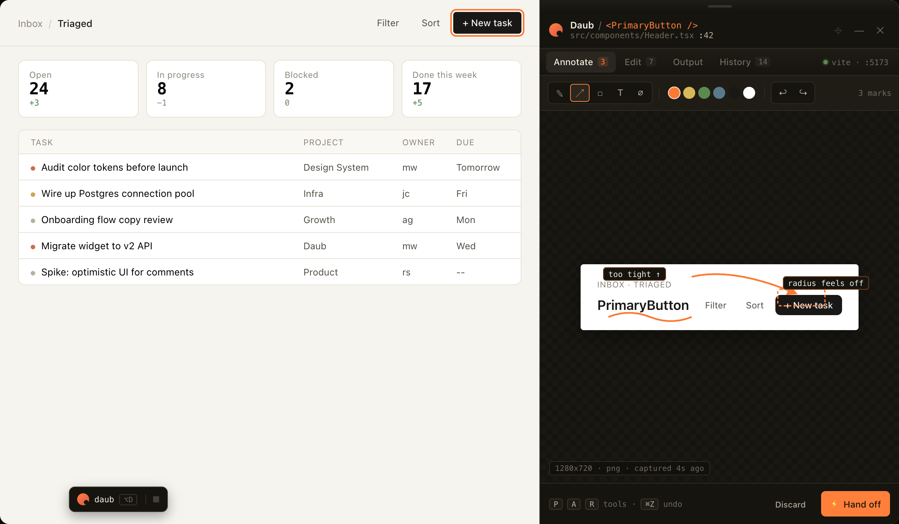

# Daub

Visual component context tool for AI-assisted UI development. A Vite plugin that injects a floating widget into your dev app -- click a component, annotate it, tweak styles, and hand off rich context to Claude Code.

<p align="center">
  
</p>

## What it does

1. **Select** -- Click the trigger button, hover your app, click a component
2. **Annotate** -- Draw arrows, rectangles, text labels on the screenshot
3. **Edit** -- Drill into the component tree, adjust spacing/typography/colors/layout live
4. **Hand off** -- One click copies a structured summary (screenshot, CSS delta, source location, DOM subtree) to your clipboard for Claude Code

## Packages

| Package | Description |
|---------|-------------|
| `vite-plugin-daub` | Vite plugin -- drop into `vite.config.ts` |
| `@daub/core` | Shared types, serializer, style differ |
| `@daub/overlay` | Browser UI (shadow DOM, vanilla TS) |
| `@daub/next` | Next.js adapter |

## Install

```bash
npm install -D vite-plugin-daub
```

## Setup (Vite)

```ts
// vite.config.ts
import { defineConfig } from 'vite';
import daub from 'vite-plugin-daub';

export default defineConfig({
  plugins: [daub()],
});
```

## Setup (Next.js)

```ts
// next.config.ts
import { withDaub } from '@daub/next';

export default withDaub({
  // your next config
});
```

## Options

```ts
daub({
  enabled: true,           // default: true (only runs in dev)
  position: 'bottom-right', // trigger button position
  shortcut: 'Alt+Shift+D', // keyboard shortcut to activate
  triggerStyle: 'pill',     // 'pill' or 'compact'
  outputDir: '.daub-output', // where screenshots are saved on disk
})
```

## How it works

The plugin injects a floating widget into your running dev app via a virtual module (`/@daub/overlay`). The widget lives in a Shadow DOM so it never interferes with your app's styles. When you select a component:

- A screenshot is captured via the Screen Capture API
- Source location is resolved from React/Vue/Svelte fiber data
- Computed styles are captured for diffing
- The panel lets you annotate, edit styles live, and export everything

The "Copy & hand off" button writes the session to `.daub-output/` (screenshots as files) and copies a structured markdown summary to clipboard. Paste it into Claude Code and it has full visual context.

## Known limitations

- Screen Capture API requires a one-time browser permission dialog per session
- Source resolution works best with React (Vue and Svelte support is basic)
- The overlay uses `adoptedStyleSheets` which requires a modern browser
- Next.js adapter requires webpack mode (`--no-turbo`)
- No Playwright/e2e tests yet -- manual testing via the example app

## Development

```bash
pnpm install
pnpm build        # sequential: core -> overlay -> plugin -> next
pnpm dev          # watch mode for core + overlay
pnpm test         # vitest
```

Packages must build in order: `core -> overlay -> plugin -> next`.

## License

MIT
